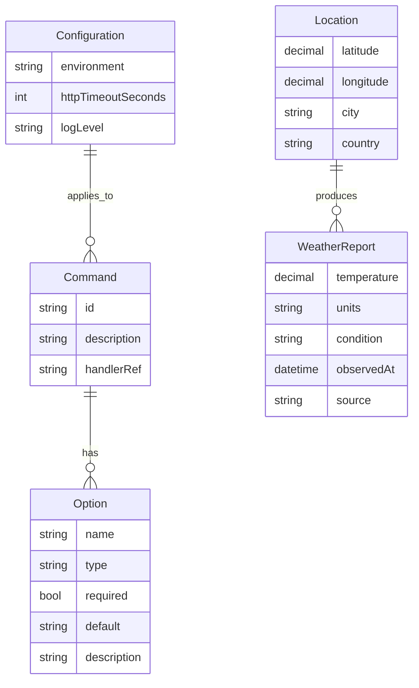

# Domain Model for Archetype CSharp CLI

## Overview

Archetype CSharp CLI operates in the developer tooling/template domain, managing CLI commands, options, configuration, and sample weather data retrieval to showcase best practices for .NET CLI applications.

## Main Entities

### E1 Command

**Description:** Represents an executable CLI command (e.g., `weather`) with handler logic and supported options.

**Attributes:**
- id: string - Unique command identifier (e.g., "weather").
- description: string - Short help text for the command.
- options: Option[] - List of supported options/flags.
- handlerRef: string - Reference to the handler/implementation (type name).

### E2 Option

**Description:** A parameter/flag accepted by a command.

**Attributes:**
- name: string - Option name (e.g., "--units").
- type: string - Data type (string|int|bool|enum).
- required: bool - Whether the option is mandatory.
- default: string - Default value if not provided.
- description: string - Help/usage description.

### E3 Configuration

**Description:** Application configuration controlling behavior across environments.

**Attributes:**
- environment: string - Current environment name (e.g., Development, CI).
- httpTimeoutSeconds: int - Default HTTP timeout for external calls.
- logLevel: string - Minimum log level (e.g., Information, Debug).

### E4 Location

**Description:** Geographical position derived from IP geolocation.

**Attributes:**
- latitude: decimal - Latitude in degrees (-90..90).
- longitude: decimal - Longitude in degrees (-180..180).
- city: string - City name if available.
- country: string - Country name if available.

### E5 WeatherReport

**Description:** Weather information retrieved for a location.

**Attributes:**
- temperature: decimal - Current temperature.
- units: string - Unit system (metric|imperial).
- condition: string - Text summary (e.g., "Clear", "Rain").
- observedAt: datetime - Timestamp for the observation.
- source: string - External provider (e.g., "open-meteo").

## Entity Relationships

### R1 Command ↔ Option

**Relationship Type:** One-to-Many
**Description:** A Command declares zero or more Options; an Option belongs to one Command.
**Business Rule:** Options refine command behavior; names must be unique within a command.

### R2 Location ↔ WeatherReport

**Relationship Type:** One-to-Many
**Description:** A Location can produce multiple WeatherReports over time; each WeatherReport is for one Location.
**Business Rule:** Reports are time-bound; units derive from command input or configuration.

### R3 Configuration ↔ Command

**Relationship Type:** One-to-Many
**Description:** A single Configuration instance applies to all commands during a run.
**Business Rule:** Commands read configuration for defaults (timeouts, log level) and environment overrides.

## Business Rules and Validations

### Data Validation 

- Units must be one of {metric, imperial}; default is metric.
- Timeout must be between 1 and 60 seconds; default per configuration if not provided.
- Latitude must be within [-90, 90]; longitude within [-180, 180].
- Command names must be non-empty and unique within the CLI host.
- Option names must be unique within their command and start with `-` or `--` per framework conventions.

### Business Operation Rules

- If geolocation fails, the weather command must exit with a non-zero code and print an actionable error message.
- If the weather API fails or times out, the command must return a non-zero exit code and suggest retry/action.
- In Release builds, suppress stack traces by default; prefer concise messages with guidance.
- Logging should include correlation (command name, options) for each execution.

## Entity-Relationship Diagram

## Additional Information

- Git repository: https://github.com/AIDDbot/ArchetypeCSharpCLI
- PRD Document: ./PRD.md
- SYSTEMS Architecture: ./SYSTEMS.md
- BACKLOG of features: ./BACKLOG.md

> End of DOMAIN for Archetype CSharp CLI, last updated on 2025-08-28.
