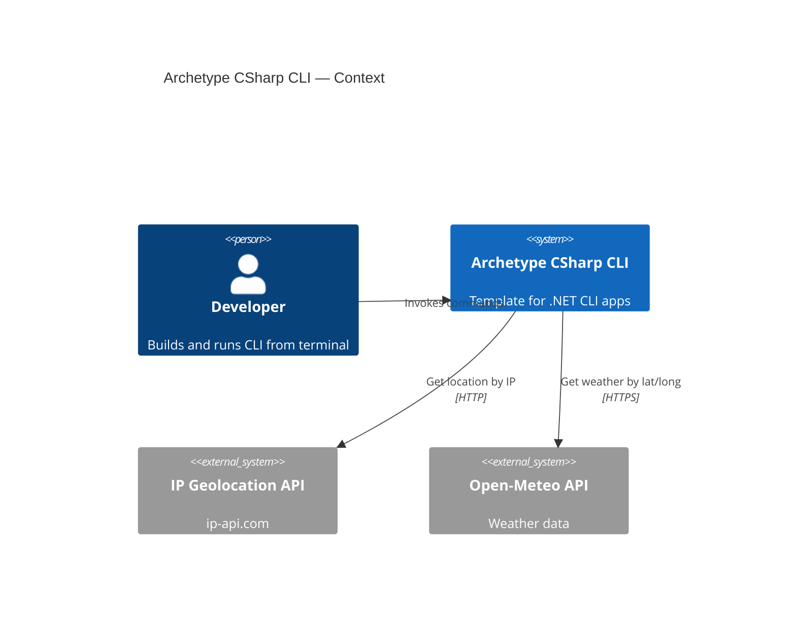

# Project Requirements Document for Archetype CSharp CLI

## Overview

Archetype CSharp CLI aims to provide a minimal, idiomatic template for building .NET command‑line applications with batteries‑included developer experience (configuration, logging, DI, testing) and a sample weather command that demonstrates HTTP calls and option parsing.

### Goals 

- Bootstrap .NET 9 CLI apps quickly and consistently.
- Offer clear structure for commands, configuration, logging, DI, and HTTP.
- Include a simple “weather” example using public APIs.
- Ship concise docs in `/docs` and a practical README.

## Requirements

### R1 CLI Host and Basic Commands

Provide a command framework (Spectre.Console.Cli or System.CommandLine) with `--help` and `--version`, subcommands, options, and validation.

### R2 Weather Command

`weather` resolves current location via IP (ip-api.com) and fetches weather from Open‑Meteo; supports `--units` (metric|imperial), `--raw`, and `--timeout`; prints summary and stable exit codes.

### R3 Configuration and Logging

Load settings from appsettings*.json and environment variables; bind to typed options. Use Microsoft.Extensions.Logging (optionally Serilog) with structured console output.

### R4 Dependency Injection and HTTP Resilience

Wire services via Microsoft.Extensions.DependencyInjection; use typed HttpClient with sensible timeouts and graceful error handling.

### R5 Testing and CI

Include xUnit tests for core logic and an example GitHub Actions workflow for build and test.

## Technical Constraints

- .NET 9 SDK; C# 11; cross‑platform (Windows/macOS/Linux where supported).
- Use free, anonymous external APIs (ip-api.com and open-meteo.com). Note: ip-api.com uses HTTP for the free tier; no secrets sent.
- Keep template lightweight (no heavy scaffolding/generators by default).

### System C4 Context diagram

## Additional Information

- [Git repository:](https://github.com/AIDDbot/ArchetypeCSharpCLI)
- [DOMAIN Models:](./DOMAIN.md)
- [SYSTEMS Architecture:](./SYSTEMS.md)
-[BACKLOG of features:](./BACKLOG.md)

> End of PRD for Archetype CSharp CLI, last updated on 2025-08-28.
