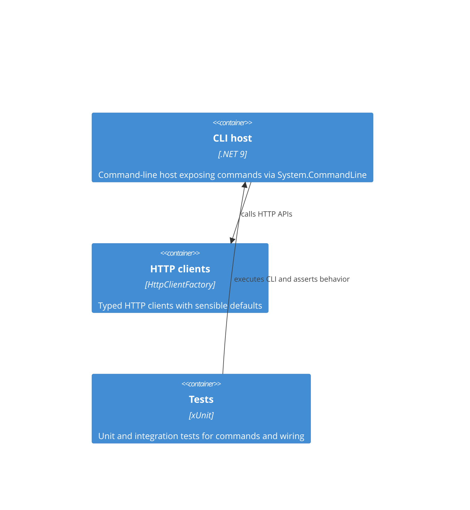

# Structure for Archetype CSharp CLI

## Overview

Archetype CSharp CLI is an opinionated starter template for building .NET command-line applications.
It groups code by feature/domain under `src/`, and uses Microsoft.Extensions patterns for configuration, options, logging and HttpClient integration.

## Bill of Materials

- **Language**: C# (nullable reference types enabled, implicit usings)
- **Framework / Runtime**: .NET 9 (target: `net9.0`). SDK pinned in `global.json` (9.0.304)
- **State Management**: N/A (no local database; in-memory/POCO domain models)
- **Styling / UI**: N/A (command-line application)
- **Testing**: xUnit + Microsoft.NET.Test.Sdk
- **Build Tools**: .NET CLI (`dotnet build`, `dotnet test`, `dotnet publish`)

### Development / Deployment workflow

- Restore & build: `dotnet restore` && `dotnet build` (repo root) or target project folder.
- Run locally: `dotnet run --project src/ArchetypeCSharpCLI -- --help` (or pass command args).
- Test: `dotnet test` (runs test project `ArchetypeCSharpCLI.Tests`).
- Configuration precedence: `appsettings.json` -> `appsettings.{Environment}.json` -> Environment Variables.
- Environment selection: `DOTNET_ENVIRONMENT` / `ASPNETCORE_ENVIRONMENT` (default `Production`).
- Release: `dotnet publish -c Release --self-contained false` (or produce self-contained binaries when needed).

## Folder Structure

```
/(repo root)
├─ src/
│  ├─ ArchetypeCSharpCLI/            # CLI application (presentation + wiring)
│  │  ├─ ArchetypeCSharpCLI.csproj
│  │  ├─ Program.cs                   # Host and System.CommandLine wiring
│  │  ├─ appsettings.json             # Default configuration (copied to output)
│  │  ├─ Commands/                    # Domain commands and handlers (e.g. Weather)
│  │  ├─ Configuration/               # Config builder, typed POCOs and binding helpers
│  │  ├─ Http/                        # Http clients, extensions and API clients
│  │  ├─ Logging/                     # Console logging helpers
│  │  ├─ Domain/                      # Domain models (WeatherReport, Location, ...)
│  │  ├─ Dtos/                        # DTOs for external APIs
│  │  └─ Mappers/                     # DTO -> Domain mappers
│  └─ ArchetypeCSharpCLI.Tests/      # Unit and integration tests
├─ docs/                             # Architecture and product documents
├─ ArchetypeCSharpCLI.sln
├─ global.json                        # SDK pin
├─ README.md
└─ LICENSE
```

## Key files

- **`src/ArchetypeCSharpCLI/ArchetypeCSharpCLI.csproj`**: Project definition; target framework `net9.0`; package references include System.CommandLine and Microsoft.Extensions packages.
- **`src/ArchetypeCSharpCLI/Program.cs`**: Application entry point; host creation, DI registration, and root command wiring via System.CommandLine.
- **`src/ArchetypeCSharpCLI/appsettings.json`**: Default configuration values (e.g. `Environment`, `HttpTimeoutSeconds`, `LogLevel`).

Other notable files:

- `docs/PRD.md`, `docs/DOMAIN.md`, `docs/SYSTEMS.md`, `docs/BACKLOG.md` — project documentation and backlog.

## Components diagram



> End of STRUCTURE for Archetype CSharp CLI, last updated on 2025-09-02.
