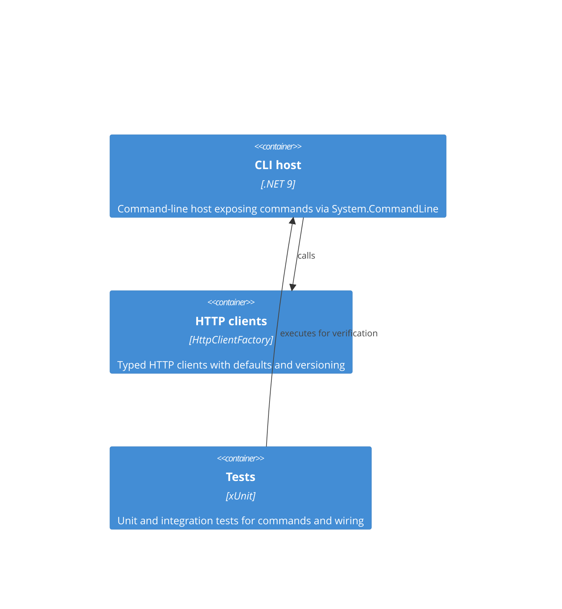

## Project structure for Archetype CSharp CLI

Overview

Archetype CSharp CLI is a small, opinionated starter for building .NET command-line applications.
It follows Screaming Architecture and Separation of Concerns: features grouped by domain under `src/`, with clear responsibilities for configuration, commands, HTTP clients, mappers and logging.

Bill of Materials

- Language: C# 12 with nullable reference types enabled and implicit usings
- Runtime & SDK: .NET 9 (net9.0). SDK pinned in `global.json` (9.0.304)
- CLI framework: System.CommandLine (2.0.0-beta4)
- Microsoft.Extensions.* packages for configuration, options and logging (v9)
- Testing: xUnit + Microsoft.NET.Test.Sdk

Development / Deployment workflow

- Build locally: `dotnet build` (repo root) or `dotnet build src/ArchetypeCSharpCLI`.
- Run CLI during development: `dotnet run --project src/ArchetypeCSharpCLI -- --help`.
- Run tests: `dotnet test`.
- Configuration precedence: `appsettings.json` -> `appsettings.{Environment}.json` -> Environment Variables. Use `DOTNET_ENVIRONMENT` / `ASPNETCORE_ENVIRONMENT` to select environment (default: Production).
- Release: create a versioned build and produce a self-contained or framework-dependent artifact using `dotnet publish`.

Folder structure

```
/(repo root)
├─ src/
│  ├─ ArchetypeCSharpCLI/            # CLI application (presentation + wiring)
│  │  ├─ ArchetypeCSharpCLI.csproj
│  │  ├─ Program.cs                   # Host and System.CommandLine wiring
│  │  ├─ appsettings.json             # Default configuration (copied to output)
│  │  ├─ Commands/                    # Domain commands and handlers
│  │  ├─ Configuration/               # Config builder, typed POCOs and binding helpers
│  │  ├─ Http/                        # Http clients, extensions and version info
│  │  ├─ Logging/                     # Logging helpers and console formatting
│  │  ├─ Domain/                      # Domain models (e.g. WeatherReport, Location)
│  │  ├─ Dtos/                        # DTOs for external APIs
│  │  └─ Mappers/                     # DTO -> Domain mappers
│  └─ ArchetypeCSharpCLI.Tests/      # Unit and integration tests
├─ docs/                             # Architecture and product documents
├─ ArchetypeCSharpCLI.sln
├─ global.json                        # SDK pin
├─ README.md
└─ LICENSE
```

Key files

- `src/ArchetypeCSharpCLI/ArchetypeCSharpCLI.csproj`: project file; target `net9.0`; references to System.CommandLine and Microsoft.Extensions packages.
- `src/ArchetypeCSharpCLI/Program.cs`: application entry point, host and DI setup, root command wiring.
- `src/ArchetypeCSharpCLI/appsettings.json`: default configuration values (Environment, HttpTimeoutSeconds, LogLevel).
- `src/ArchetypeCSharpCLI/Commands/`: contains command definitions and handlers (e.g. Weather command).
- `docs/PRD.md`, `docs/DOMAIN.md`, `docs/SYSTEMS.md`, `docs/BACKLOG.md`: existing project docs to guide feature work.

Configuration

- Sources: `appsettings.json` -> `appsettings.{Environment}.json` -> Environment variables.
- Environment selection: `DOTNET_ENVIRONMENT` or `ASPNETCORE_ENVIRONMENT` (default `Production`).
- Environment variables support both flat keys (e.g. `HttpTimeoutSeconds`) and hierarchical keys using `__` (e.g. `App__HttpTimeoutSeconds`).
- Typed binding helpers and options validation are provided by the `Configuration` feature in the codebase.

Database and external services

- There is no database in this archetype. The project includes HTTP client helpers and sample integrations (weather, geo-ip) under `Http/`.

Components diagram (C4 - high level)



How to run (developer quick steps)

1. Install .NET 9 SDK (9.0.304 suggested per `global.json`).
2. From repo root: `dotnet restore` then `dotnet build`.
3. Run CLI: `dotnet run --project src/ArchetypeCSharpCLI -- --help`.
4. Run tests: `dotnet test`.

Notes

- The repository follows the "screaming architecture" approach (feature-first folders under `src/`).
- Use `Options` binding and `Microsoft.Extensions.*` patterns for configuration and logging.
- For adding new features: create a new domain folder under `src/ArchetypeCSharpCLI` (e.g., `Orders/`) with commands, domain models, dtos and mappers.

Last updated: 2025-09-02
