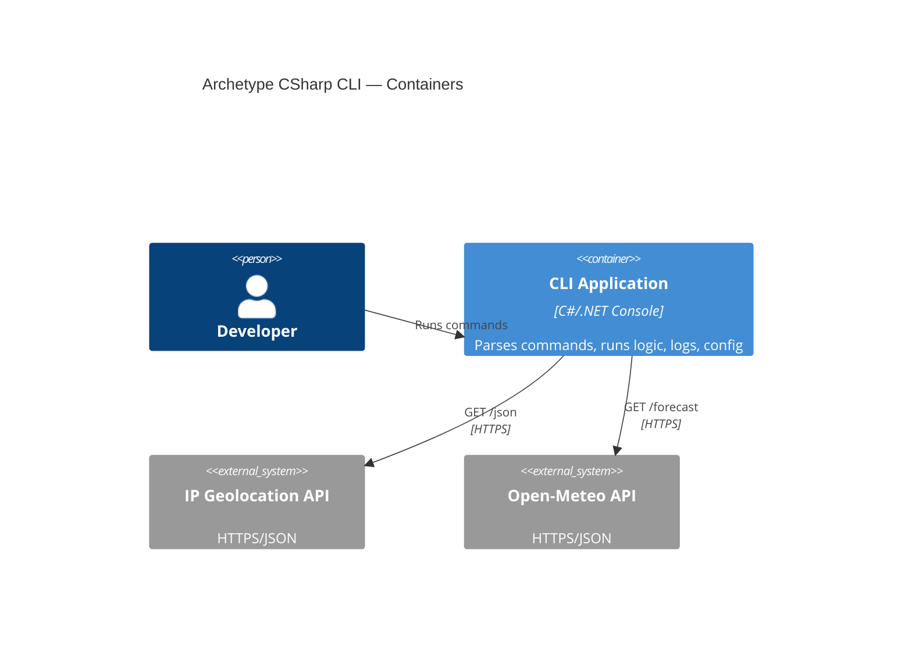

# Systems Architecture for Archetype CSharp CLI

Follows the glossary of terms and concepts from AIDDbot Glossary.

## Overview

Archetype CSharp CLI is a single-process console application (Presentation tier only). There are no separate service or data tiers; all logic executes within the CLI process. It is designed for simplicity, robustness, and great developer experience using .NET conventions and Microsoft.Extensions.* libraries. The CLI performs outbound HTTPS calls to public APIs.

## Presentation Tier

### A1 CLI Application (Console)

**Purpose:** User entry point that parses commands/options, renders help, and orchestrates command execution.

**Technology Stack:**

- Language: c-sharp
- Framework: .net (Console)
- Key Libraries: System.CommandLine or Spectre.Console.Cli, Microsoft.Extensions.Logging
- Other Packages: Microsoft.Extensions.Configuration, System.Text.Json

**Responsibilities:**

- Parse args and validate options
- Display help, usage, and version
- Map commands to handlers and exit codes

## Application Tier

Not applicable. There is no separate application/service tier; command handling and orchestration run inside the CLI application.

## Data Tier

Not applicable. No persistent data stores are used. The CLI reads transient configuration (appsettings.json and environment variables) at startup.

## Integration Patterns

### I1 Outbound REST Calls

**Type:** REST API
**Purpose:** Retrieve IP-based geolocation and weather data
**Protocol:** HTTPS
**Data Format:** JSON

Providers:
- IP Geolocation API (ip-api.com)
- Open‑Meteo API (open-meteo.com)

## Security Architecture

### Authentication & Authorization

**Authentication Method:** None for local CLI usage; outbound calls are anonymous HTTPS.
**Session Management:** Not applicable.
**Authorization Pattern:** Not applicable.

Hardening:
- All external traffic over HTTPS
- No secrets stored; configuration via env vars and files
- Minimal PII; do not persist IP-derived data

## Systems Architecture Diagram

## Additional Information

- Git repository: https://github.com/AIDDbot/ArchetypeCSharpCLI
- PRD Document: ./PRD.md
- DOMAIN Models: ./DOMAIN.md
- BACKLOG of features: ./BACKLOG.md

> End of SYSTEMS for Archetype CSharp CLI, last updated on 2025-08-28.
