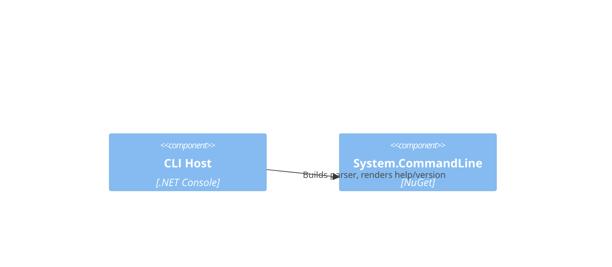

# F1.1 CLI host skeleton and help/version Design 

## Overview

Minimal .NET console app using System.CommandLine as the command framework. The root command provides description, `--version` (alias `-v`) and default help. No additional subcommands yet; structure anticipates future features (routing, config, logging).

## Data Models

No domain data models are needed for this feature.

## Components

### Program (Entry Point)

- Purpose: Build and run a System.CommandLine `RootCommand` with help and version options, map exit code.
- Interfaces: static `Task<int> Main(string[] args)`
- Dependencies: System.CommandLine
- Reuses: N/A

```csharp
// Public API surface: Program.Main
// Runs a CommandLineBuilder with Help, Version and default middleware.
```

## User interface

### Command: root

- Purpose: Display help and version; host future subcommands
- URL/Name: invocation of the console application

## Aspects

### Monitoring

- For now, none. Future logging will use Microsoft.Extensions.Logging.

### Security

- No secrets or PII. Default hardening not applicable.

### Error Handling

- Non-successful parse returns non-zero exit code. Unhandled exceptions bubble to non-zero exit.

## Architecture

- Pattern: Console app with System.CommandLine pipeline.

### Component Diagram



### File Structure

```plaintext
/ (repo)
  /src
    /ArchetypeCSharpCLI
      Program.cs         // entry point
      ArchetypeCSharpCLI.csproj
  global.json            // pin SDK (optional)
```

> End of Feature Design for F1.1, last updated 2025-08-28.
