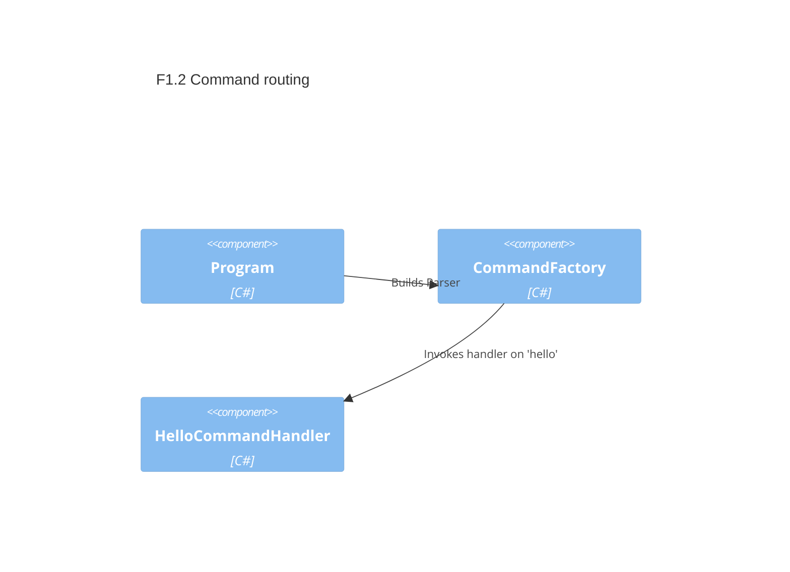

# F1.2 Command routing and option validation — Design

## Overview

Introduce a minimal, extensible pattern for subcommands using System.CommandLine. Add one sample subcommand `hello` with a required `--name|-n <text>` option and simple validation. Keep root help/version behavior intact. This establishes conventions for future commands (e.g., weather).

## Data Models

### HelloOptions

- Purpose: Input model for the `hello` command handler.
- Tier / Layer: Presentation (CLI parsing layer).

```csharp
public sealed class HelloOptions
{
  public string Name { get; init; } = string.Empty; // required, non-empty
}
```

## Components

### CommandFactory

- Purpose: Central place to build the root command and subcommands.
- Interfaces: `static Parser BuildParser()` (public); internal helpers to create each command.
- Dependencies: System.CommandLine.
- Reuses: Existing `Program.BuildParser` structure.

```csharp
public static class CommandFactory
{
  public static Parser BuildParser();
}
```

### HelloCommandHandler

- Purpose: Implements the `hello` command behavior.
- Interfaces: `static Task<int> HandleAsync(HelloOptions opts)`; returns exit code.
- Dependencies: None beyond BCL; writes to console.

```csharp
public static class HelloCommandHandler
{
  public static Task<int> HandleAsync(HelloOptions opts);
}
```

## User interface

### Command: hello

- Purpose: Print a friendly greeting using the provided name.
- Command name: `hello`
- Options:
  - `--name|-n <text>` (required) — Name to greet; must be non-empty/whitespace.

Usage examples:
- `archetype hello --name Alice`

## Aspects

### Monitoring

- For now, rely on console output. Future logging will integrate via Microsoft.Extensions.Logging.

### Security

- No secrets or PII persisted. The provided name is printed back to user; avoid logging beyond console output.

### Error Handling

- Validation at parse time: required option and non-empty constraint. On invalid input, System.CommandLine emits error and non-zero exit. Handlers map success to 0.

## Architecture

Use System.CommandLine’s `Command` and `Option<T>` with validators. Keep construction isolated in `CommandFactory` to simplify testing and future DI.

### Component Diagram



### File Structure

```
src/ArchetypeCSharpCLI/
  Program.cs            # uses CommandFactory.BuildParser
  Commands/
    CommandFactory.cs   # builds root + subcommands
    Hello/
      HelloOptions.cs
      HelloCommandHandler.cs
```

> End of Feature Design for F1.2, last updated 2025-08-28.
