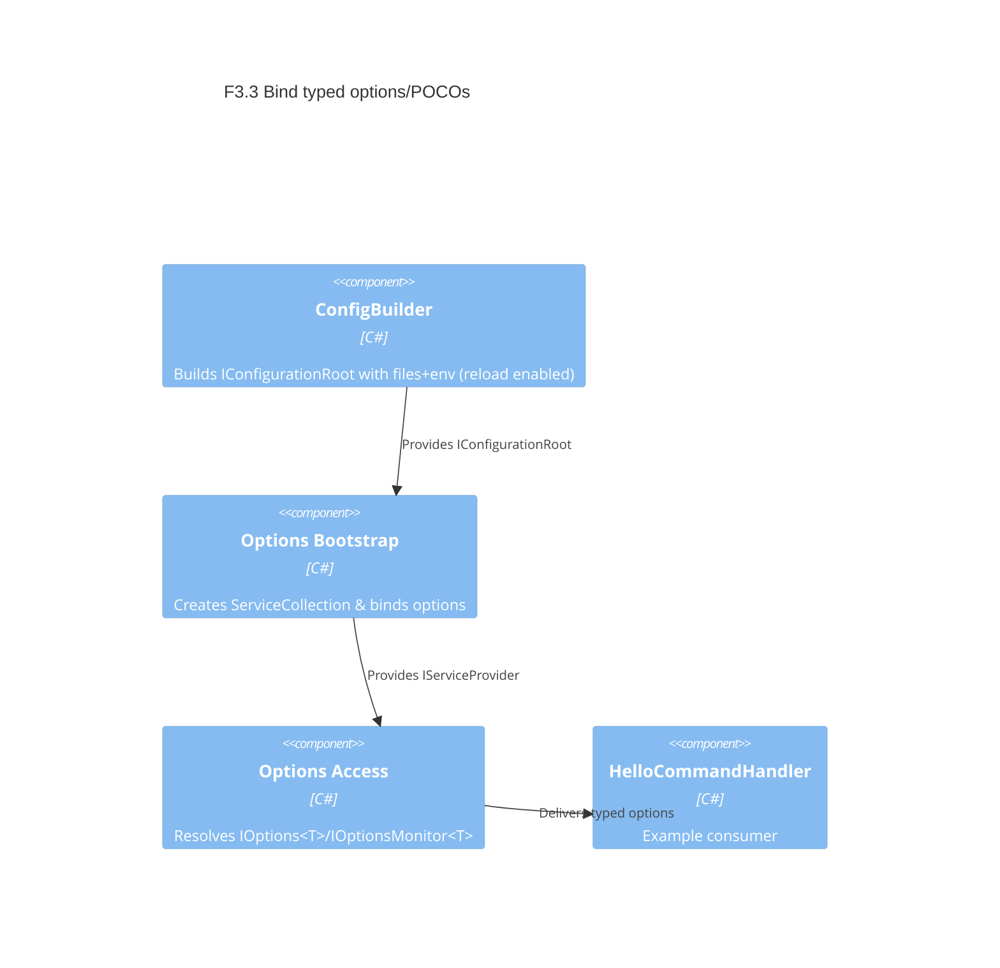

# F3.3 Bind typed options/POCOs Design 

## Overview

Introduce a simple, reliable way to bind configuration sections to typed POCOs with validation and live reload, using Microsoft.Extensions.Configuration and Microsoft.Extensions.Options. Keep it minimal: no full DI adoption yet, but set foundations so later DI (R4) can absorb this with no breaking changes.

Goals
- Bind config sections to typed options with safe defaults.
- Validate via DataAnnotations and simple custom predicates.
- Support reload-on-change for JSON files so IOptionsMonitor<T> reflects updates.
- Keep current host structure; avoid invasive DI changes.

Assumptions
- Current CLI remains single-process with System.CommandLine.
- Config sources and precedence from F3.1 remain as-is.
- We can enable reloadOnChange for JSON providers.

## Data Models

### Options Model (generic T)

- Purpose: Input model for bound configuration; consumed via IOptions<T>/IOptionsMonitor<T>.
- Tier / Layer: Presentation / Configuration

```csharp
// Example options type a consumer might define later
public sealed class HttpOptions
{
  [Range(1, 300)]
  public int TimeoutSeconds { get; init; } = 30;
}
```

## Components

### Component 1: Options Bootstrap

- Purpose: Create a minimal ServiceCollection to host Options and Configuration bindings.
- Interfaces: public static IServiceProvider Init(IConfiguration cfg, Action<IServiceCollection>? configure = null)
- Dependencies: Microsoft.Extensions.Configuration, Microsoft.Extensions.Options
- Reuses: ConfigBuilder.BuildRaw()
  
```csharp
// Public API sketch
public static class OptionsBootstrap
{
  private static IServiceProvider? _sp;
  public static IServiceProvider Init(IConfiguration cfg, Action<IServiceCollection>? configure = null)
  {
    var services = new ServiceCollection();
    services.AddOptions();
    services.AddSingleton(cfg);
    configure?.Invoke(services);
    _sp = services.BuildServiceProvider();
    return _sp;
  }
}
```

### Component 2: Options Extensions

- Purpose: Register bound and validated options.
- Interfaces:
  - IServiceCollection AddBoundOptions<T>(this IServiceCollection services, IConfiguration cfg, string sectionName, Action<T>? postConfigure = null, Func<T, bool>? validate = null, string? validateError = null)
- Dependencies: IOptions, IConfigurationBinder
  
```csharp
public static class OptionsExtensions
{
  public static IServiceCollection AddBoundOptions<T>(this IServiceCollection services, IConfiguration cfg, string sectionName,
    Action<T>? postConfigure = null, Func<T, bool>? validate = null, string? validateError = null) where T : class, new()
  {
    services.AddOptions<T>()
      .Bind(cfg.GetSection(sectionName))
      .ValidateDataAnnotations();
    if (postConfigure is not null) services.PostConfigure(postConfigure);
    if (validate is not null) services.PostConfigure<T>(o =>
    {
      if (!validate(o)) throw new OptionsValidationException(typeof(T).Name, typeof(T), new[] { validateError ?? "custom validation failed" });
    });
    return services;
  }
}
```

### Component 3: Options Access

- Purpose: Provide access to IOptions<T>/IOptionsMonitor<T> for consumers without full DI.
- Interfaces:
  - static IOptions<T> Get<T>()
  - static IOptionsMonitor<T> GetMonitor<T>()
- Dependencies: IServiceProvider created by OptionsBootstrap
  
```csharp
public static class OptionsAccess
{
  private static IServiceProvider? _sp => OptionsBootstrapAccessor.ServiceProvider;
  public static IOptions<T> Get<T>() where T : class => _sp!.GetRequiredService<IOptions<T>>();
  public static IOptionsMonitor<T> GetMonitor<T>() where T : class => _sp!.GetRequiredService<IOptionsMonitor<T>>();
}
```

## User interface

No new CLI commands or options. This is an internal facility. Existing commands can optionally consume options via OptionsAccess.

### Command 1 (no UI change)

- Purpose: N/A
- URL/Command: N/A

## Aspects

### Monitoring

- Log one-time info at bootstrap about environment and reload enabled.
- Optionally log change notifications when IOptionsMonitor<T> updates.

### Security

- No secrets. Only binds public POCOs. Ensure no sensitive data is logged.

### Error Handling

- Validation failures surface a clear error message indicating the offending property and constraint.
- Consumers may choose to treat invalid options as startup errors (exit non-zero) or fallback to defaults.

## Architecture

The feature adds a thin binding layer around existing configuration.



### File Structure

```
src/ArchetypeCSharpCLI/
  Configuration/
    ConfigBuilder.cs           # enable reloadOnChange for JSON providers
    Binding/
      OptionsBootstrap.cs      # build ServiceCollection; AddOptions(); store provider
      OptionsExtensions.cs     # AddBoundOptions<T> helpers with validation/post-configure
      OptionsAccess.cs         # static accessor for IOptions<T>/IOptionsMonitor<T>
```

> End of Feature Design for F3.3, last updated 2025-08-28.
