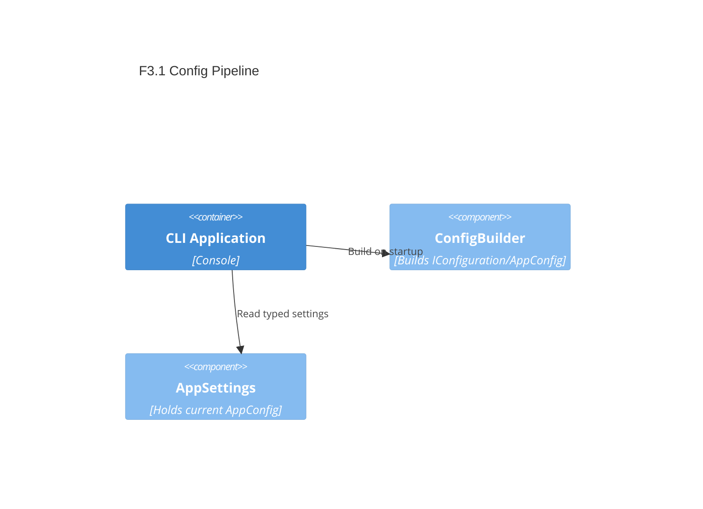

# F3.1 Configuration pipeline (appsettings + env) Design 

## Overview

Add a minimal configuration subsystem to the CLI using Microsoft.Extensions.Configuration. The CLI will build a configuration root from: current directory, appsettings.json, appsettings.{Environment}.json (optional), and environment variables; then bind to a typed AppConfig with safe defaults. Commands can request AppConfig from a simple static accessor initially (no DI yet) to keep coupling low.

## Data Models

### AppConfig

- Purpose: Typed runtime settings for input; consumed by handlers (Input)
- Tier / Layer: Presentation (Console process)

```csharp
public sealed class AppConfig
{
  public string Environment { get; init; } = "Production";
  public int HttpTimeoutSeconds { get; init; } = 30; // 1..300
  public string LogLevel { get; init; } = "Information";
}
```

## Components

### ConfigBuilder

- Purpose: Build IConfigurationRoot from files + env and bind to AppConfig with normalization
- Interfaces:
  - static AppConfig Build()
  - static IConfigurationRoot BuildRaw()
- Dependencies: Microsoft.Extensions.Configuration.* packages
- Reuses: N/A
  
```csharp
public static class ConfigBuilder
{
  public static IConfigurationRoot BuildRaw();
  public static AppConfig Build();
}
```

### Configuration Access

- Purpose: Provide a singleton-like cached access to AppConfig to avoid rebuilding.
- Interfaces:
  - static AppConfig Current { get; }
- Dependencies: ConfigBuilder

```csharp
public static class AppSettings
{
  public static AppConfig Current { get; }
}
```

## User interface

Command-line remains unchanged. Future features (logging) will consume AppSettings.Current.

### Command: n/a

- Purpose: Cross-cutting, no new commands.

## Aspects

### Monitoring

- Use console logging later; for now, minimal.

### Security

- No secrets; environment variables are read-only.

### Error Handling

- Missing files are ignored. Invalid numeric values are clamped to defaults. No exceptions thrown for config.

## Architecture

- Pattern: Builder + simple cached accessor. Keep DI introduction for a later feature.

### Component Diagram



### File Structure

```plaintext
src/ArchetypeCSharpCLI/
  Configuration/
    AppConfig.cs          # POCO with defaults
    AppSettings.cs        # Cached access to typed config
    ConfigBuilder.cs      # Builds from files + env
appsettings.json          # Defaults
appsettings.Development.json (optional)
```

> End of Feature Design for F3.1, last updated 2025-08-28.
