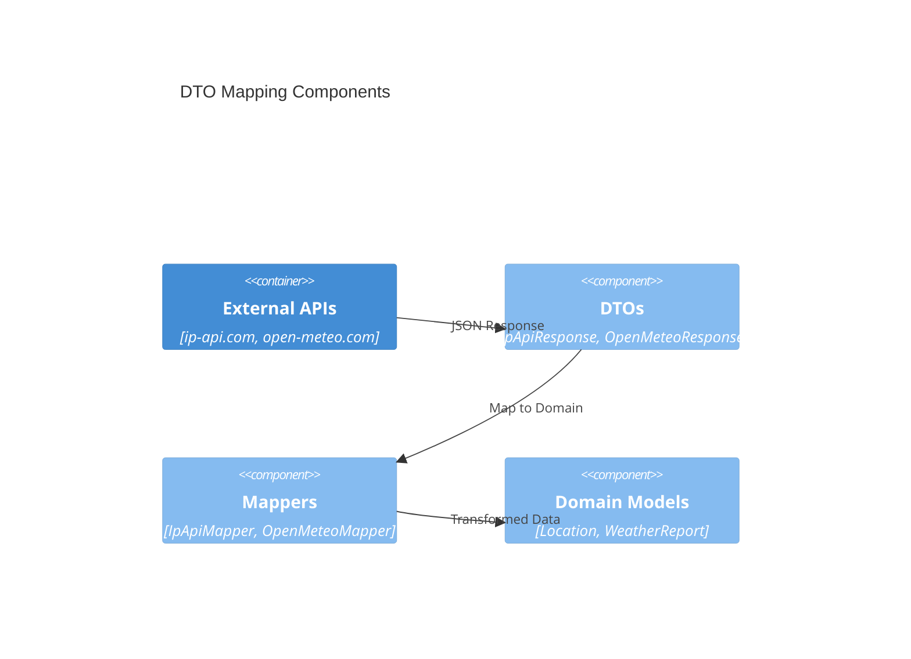

# feat-dto-mapping DTOs and mapping for external APIs Design 

## Overview

This feature defines minimal Data Transfer Objects (DTOs) for external weather APIs and provides mapping logic to convert them to internal domain models. This ensures clean separation between external API structures and internal business logic.

## Data Models

### IpApiResponse

- **Purpose:** DTO for ip-api.com geolocation response
- **Tier / Layer:** Integration

```csharp
public class IpApiResponse
{
    [JsonPropertyName("status")]
    public string? Status { get; set; }
    
    [JsonPropertyName("lat")]
    public decimal? Lat { get; set; }
    
    [JsonPropertyName("lon")]
    public decimal? Lon { get; set; }
    
    [JsonPropertyName("city")]
    public string? City { get; set; }
    
    [JsonPropertyName("country")]
    public string? Country { get; set; }
}
```

### OpenMeteoResponse

- **Purpose:** DTO for open-meteo.com weather response
- **Tier / Layer:** Integration

```csharp
public class OpenMeteoResponse
{
    [JsonPropertyName("current")]
    public CurrentWeather? Current { get; set; }
}

public class CurrentWeather
{
    [JsonPropertyName("temperature_2m")]
    public decimal? Temperature2m { get; set; }
    
    [JsonPropertyName("weather_code")]
    public int? WeatherCode { get; set; }
    
    [JsonPropertyName("time")]
    public string? Time { get; set; }
}
```

## Components

### IIpApiMapper

- **Purpose:** Maps IpApiResponse to Location domain model
- **Interfaces:** 
  - `Location MapToLocation(IpApiResponse response)`
- **Dependencies:** None
- **Reuses:** Domain Location model

```csharp
public interface IIpApiMapper
{
    Location MapToLocation(IpApiResponse response);
}
```

### IOpenMeteoMapper

- **Purpose:** Maps OpenMeteoResponse to WeatherReport domain model
- **Interfaces:** 
  - `WeatherReport MapToWeatherReport(OpenMeteoResponse response, string units)`
- **Dependencies:** Weather code to description mapping
- **Reuses:** Domain WeatherReport model

```csharp
public interface IOpenMeteoMapper
{
    WeatherReport MapToWeatherReport(OpenMeteoResponse response, string units);
}
```

### WeatherCodeMapper

- **Purpose:** Converts weather codes to human-readable descriptions
- **Interfaces:** 
  - `string GetWeatherDescription(int weatherCode)`
- **Dependencies:** Static mapping table
- **Reuses:** None

## User interface

No direct user interface - this is internal data transformation.

### API Response Processing

- **Purpose:** Clean transformation pipeline
- **Flow:** API Response → DTO → Domain Model → User Display

## Aspects

### Monitoring

- Log mapping failures with correlation IDs
- Track successful transformations
- Alert on schema changes in external APIs

### Security

- Validate input data ranges (lat/lon within bounds)
- Sanitize string fields
- Handle malformed JSON gracefully

### Error Handling

- Throw descriptive exceptions for missing required fields
- Validate coordinate ranges
- Provide meaningful error messages for invalid weather codes

## Architecture

Clean Architecture with separation between external API contracts and internal domain models.

### Component Diagram



### File Structure

```
src/ArchetypeCSharpCLI/
├── Dtos/
│   ├── IpApiResponse.cs
│   ├── OpenMeteoResponse.cs
│   └── WeatherCodeMapper.cs
├── Mappers/
│   ├── IIpApiMapper.cs
│   ├── IpApiMapper.cs
│   ├── IOpenMeteoMapper.cs
│   └── OpenMeteoMapper.cs
└── ...
```

> End of Feature Design for feat-dto-mapping, last updated 2025-08-28.</content>
<parameter name="filePath">c:\code\aidd\ArchetypeCSharpCLI\docs\backlog\feat-dto-mapping.design.md
