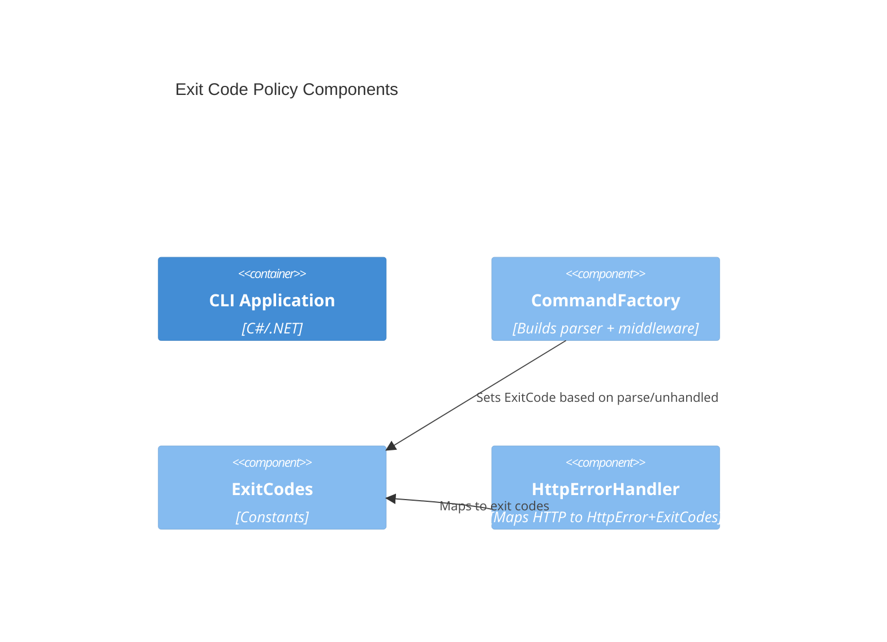

# feat-exit-codes Exit code policy and mapping Design 

## Overview

Provide a single source of truth for exit codes and wire it at the CLI host layer and HTTP infrastructure so all commands behave consistently. Keep categories minimal and map existing behaviors (System.CommandLine parse/validation and HTTP error handling).

## Data Models

### ExitCodes

- Purpose: Central constants for exit codes used by the whole CLI (Output)
- Tier / Layer: Application (Host/Commands)

```csharp
public static class ExitCodes
{
  public const int Success = 0;
  public const int NetworkOrTimeout = 1; // DNS, connection, TLS, TaskCanceled
  public const int ValidationOrClientError = 2; // parse/validation and HTTP 4xx
  public const int ServerError = 3; // HTTP 5xx
  public const int Unexpected = 4; // unhandled exceptions
}
```

## Components

### Command Host Middleware

- Purpose: Map parse errors and unhandled exceptions to ExitCodes
- Interfaces: System.CommandLine middleware in CommandLineBuilder
- Dependencies: None beyond logging (optional)
- Reuses: Existing CommandFactory BuildParser()

Behavior:
- If ParseResult has errors, set ExitCode = ExitCodes.ValidationOrClientError
- Wrap next(context) in try/catch to map unhandled exceptions to ExitCodes.Unexpected

### HttpErrorHandler integration

- Purpose: Ensure HTTP error mapping uses ExitCodes
- Interfaces: IHttpErrorHandler, HttpError
- Dependencies: ILogger
- Reuses: Existing HttpErrorHandler, HttpClientExtensions

Behavior:
- Map TaskCanceledException/OperationCanceledException to ExitCodes.NetworkOrTimeout
- Map HttpRequestException with SocketException to ExitCodes.NetworkOrTimeout
- Map non-success responses to ExitCodes.ValidationOrClientError for 4xx, ExitCodes.ServerError for 5xx
- Map any other unexpected to ExitCodes.Unexpected

## User interface

Command-line interface remains unchanged. Only process exit codes are standardized.

## Aspects

### Monitoring

- Log parse errors and unhandled exceptions at Error level with minimal context.

### Security

- No new inputs or secrets. Avoid leaking stack traces in production by default; only log detailed exceptions to structured logs.

### Error Handling

- First failure determines exit code; middleware sets ExitCode once and returns.

## Architecture

The central contract (ExitCodes) is a tiny utility referenced by host middleware and HttpErrorHandler. No new services are added.

### Component Diagram



### File Structure

```
src/ArchetypeCSharpCLI/
  ExitCodes.cs               # central constants
  Commands/CommandFactory.cs # host middleware uses ExitCodes
  Http/IHttpErrorHandler.cs  # uses ExitCodes values
  Http/HttpError.cs          # carries exit code
  Http/HttpClientExtensions.cs # throws HttpRequestException with messages (no change)
```

> End of Feature Design for feat-exit-codes, last updated 2025-08-28.
