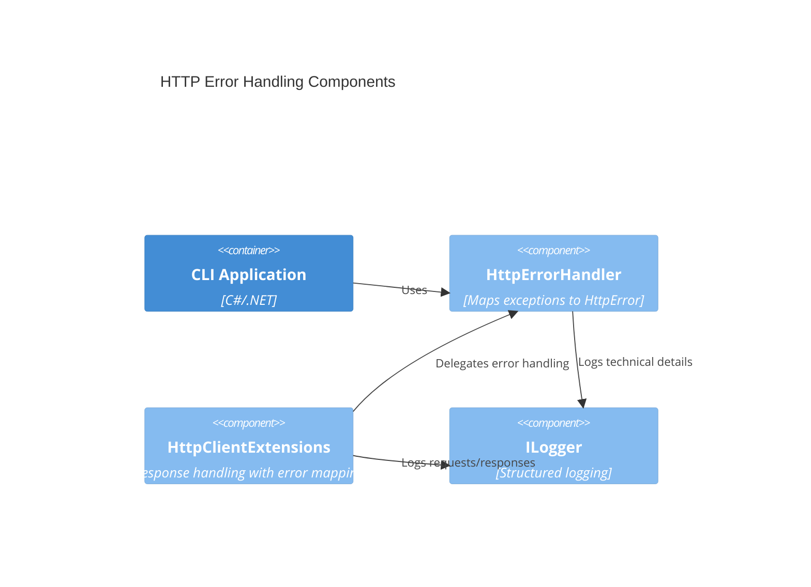

# feat-http-error-handling Error handling and non-2xx mapping Design 

## Overview

This feature extends the HTTP client infrastructure to provide comprehensive error handling for network issues, timeouts, and non-2xx HTTP responses. It ensures user-friendly error messages, consistent exit codes, and proper logging for debugging while maintaining clean separation between technical details and user-facing output.

## Data Models

### HttpError

- **Purpose:** Internal model for categorizing and handling HTTP errors
- **Tier / Layer:** Application

```csharp
public enum HttpErrorType
{
    Network,
    Timeout,
    ClientError,
    ServerError,
    Unexpected
}

public class HttpError
{
    public HttpErrorType Type { get; }
    public string Message { get; }
    public int ExitCode { get; }
    public Exception? Exception { get; }
    public string? CorrelationId { get; }
}
```

## Components

### HttpErrorHandler

- **Purpose:** Central component for processing HTTP exceptions and mapping them to user-friendly errors
- **Interfaces:** 
  - `HttpError HandleException(Exception ex)`
  - `HttpError HandleHttpResponse(HttpResponseMessage response)`
- **Dependencies:** ILogger for logging technical details
- **Reuses:** Existing HttpClient infrastructure
  
```csharp
public interface IHttpErrorHandler
{
    HttpError HandleException(Exception exception);
    HttpError HandleHttpResponse(HttpResponseMessage response);
}
```

### HttpClientExtensions

- **Purpose:** Extension methods for HttpClient to handle responses with error mapping
- **Interfaces:** 
  - `Task<T> GetFromJsonAsync<T>(string url, IHttpErrorHandler errorHandler)`
- **Dependencies:** IHttpErrorHandler, HttpClient
- **Reuses:** System.Net.Http.HttpClient

## User interface

Console output for HTTP errors with clear, actionable messages.

### Error Output Format

- **Purpose:** Standardized error display in console
- **Format:** 
  ```
  Error: {user-friendly message}
  Suggestion: {actionable guidance}
  ```

## Aspects

### Monitoring

HTTP errors are logged with structured logging including:
- Error type and message
- HTTP status code (if applicable)
- Request URL (sanitized)
- Correlation ID for tracing
- Stack trace at Debug level

### Security

- No sensitive information exposed in error messages
- Request URLs logged without query parameters
- Stack traces suppressed in Release builds

### Error Handling

- Network errors (timeouts, DNS, connection): Exit code 1
- HTTP 4xx errors: Exit code 2  
- HTTP 5xx errors: Exit code 3
- Unexpected exceptions: Exit code 4
- User messages prioritize clarity over technical details
- Technical details logged for debugging

## Architecture

The error handling follows a layered approach with clear separation of concerns.

### Component Diagram



### File Structure

```
src/ArchetypeCSharpCLI/
├── Http/
│   ├── HttpError.cs
│   ├── IHttpErrorHandler.cs
│   ├── HttpErrorHandler.cs
│   └── HttpClientExtensions.cs
└── ...
```

> End of Feature Design for feat-http-error-handling, last updated 2025-08-28.</content>
<parameter name="filePath">c:\code\aidd\ArchetypeCSharpCLI\docs\backlog\feat-http-error-handling.design.md
