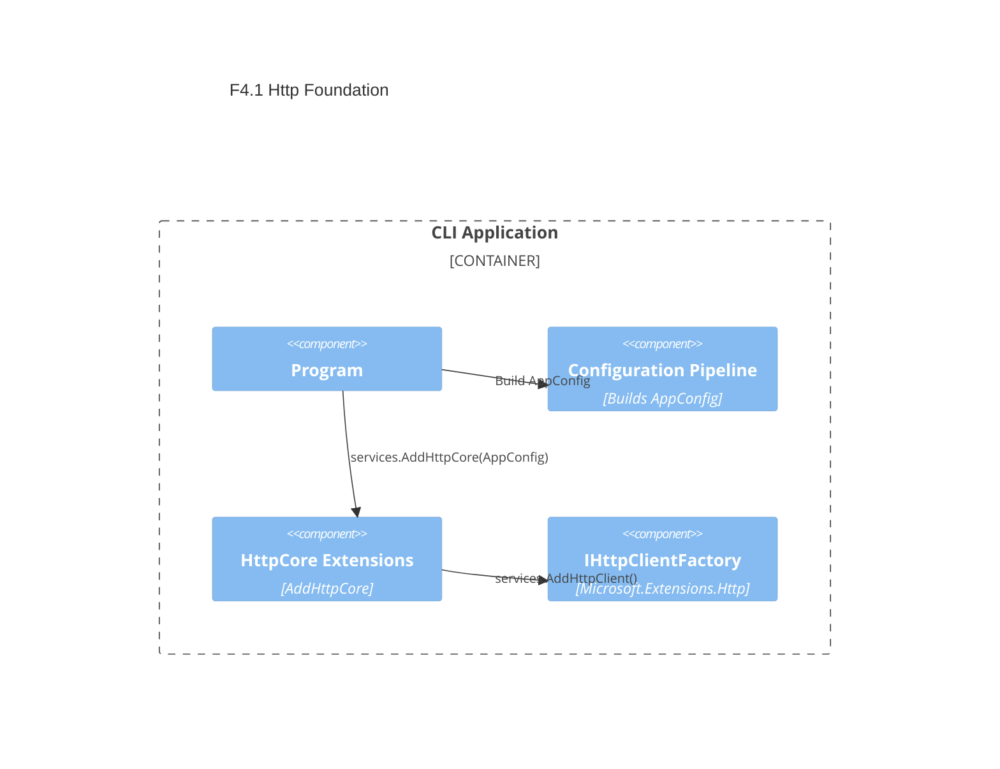

# F4.1 Typed HttpClient with sensible timeouts Design 

## Overview

Establish a minimal, robust HTTP foundation using IHttpClientFactory with defaults applied centrally:
- Default timeout sourced from AppConfig (clamped to [1, 60] seconds; default 30)
- Default User-Agent header "ArchetypeCSharpCLI/{Version}"
- Simple service registration extension to keep Program.cs clean and future clients consistent

This design prepares the ground for later features (F4.2 error handling, F2.x API clients) without adding complexity (no policies/retries yet).

## Data Models

### AppConfig (existing)

- Purpose: Input for HTTP defaults (HttpTimeoutSeconds). Bound earlier by the configuration pipeline.
- Tier / Layer: Presentation (configuration module)

```
AppConfig
- Environment: string (default: "Production")
- HttpTimeoutSeconds: int (default: 30)
- LogLevel: string (default: "Information")
```

## Components

### HttpCore

- Purpose: Centralize IHttpClientFactory registration and base HttpClient defaults (timeout, headers).
- Interfaces:
  - IServiceCollection AddHttpCore(IConfiguration config)
  - IServiceCollection AddHttpCore(this IServiceCollection services, AppConfig settings)
- Dependencies: Microsoft.Extensions.Http, Microsoft.Extensions.Configuration, AppConfig
- Reuses: OptionsBootstrap (uses the same service collection during init)
  
Public API sketch:
```
public static class HttpServiceCollectionExtensions
{
  public static IServiceCollection AddHttpCore(this IServiceCollection services, IConfiguration config);
  public static IServiceCollection AddHttpCore(this IServiceCollection services, AppConfig settings);
}
```

Behavior:
- Reads HttpTimeoutSeconds from AppConfig
- Clamps to [1, 60]
- Adds a default User-Agent header: "ArchetypeCSharpCLI/{InformationalVersion}"
- Calls services.AddHttpClient() so future AddHttpClient<TClient,TImpl> inherit defaults

### VersionInfo

- Purpose: Retrieve application version for User-Agent string.
- Interfaces: string GetInformationalVersion(Assembly? asm = null)
- Dependencies: System.Reflection
- Reuses: Same logic as Program.GetInformationalVersion (without tight coupling)

## User interface

N/A (infrastructure). Consumption points:

- Startup wiring inside Program.cs via OptionsBootstrap.Init callback:
  - OptionsBootstrap.Init(configuration, services => services.AddHttpCore(configuration));
- Feature clients (F2.1, F2.2) will register typed clients using AddHttpClient<TClient,TImpl>()

## Aspects

### Monitoring

- None added in this step. Rely on default logging; HTTP logging will be considered in F4.2.

### Security

- HTTPS usage mandated by calling sites (providers are HTTPS). No secrets used.

### Error Handling

- This feature does not add retries or error mapping.
- Timeouts surface as TaskCanceledException/OperationCanceledException; mapping is addressed in F4.2.

## Architecture

### Component Diagram



### File Structure

```
src/ArchetypeCSharpCLI/
  Http/
    HttpServiceCollectionExtensions.cs   # AddHttpCore overloads; sets defaults and registers factory
    VersionInfo.cs                       # Helper to get assembly informational version
```

Design notes:
- Keep DI minimal: reuse existing OptionsBootstrap.Init configure callback to attach HttpClient services.
- Avoid coupling to Program.GetInformationalVersion by introducing VersionInfo helper.
- No Polly/retry policies yet (deferred to F4.2).

> End of Feature Design for F4.1, last updated 2025-08-28.
